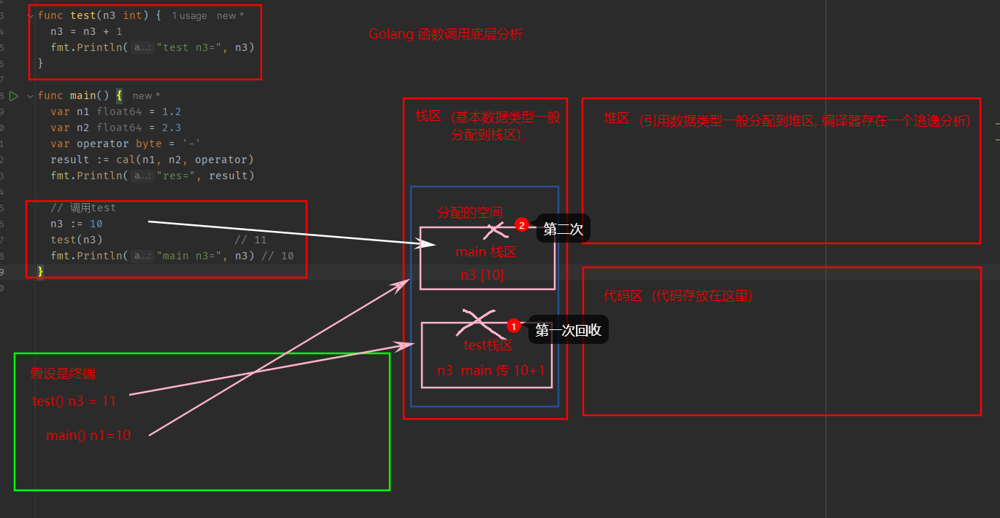
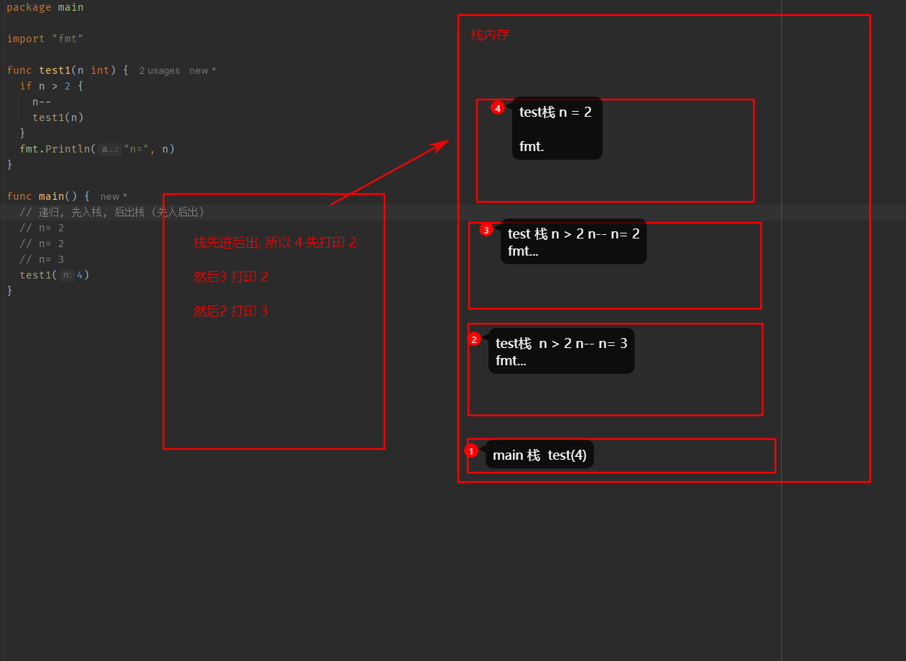

### 流程控制

在程序中, 程序运行的流程控制决定程序是如何执行的

1. 顺序控制
2. 分支控制
3. 循环控制


#### 顺序控制

程序从上到下逐行执行, 中间没有跳转

#### 分支控制

分支控制让程序有选择的执行

1. 单分支
2. 双分支
3. 多分支
4. 嵌套分支
5. switch 分支
   - switch用于基于不同条件执行不同操作, 每个case 都是唯一的, 从上到下逐一测试
   - 先执行表达式, 得到值, 和case表达式比较, 相等, 匹配, 执行相应的语句
   - 如果都没有匹配, default执行
   - case 后的表达式可以有多个, 使用逗号相隔
   - case 后是一个表达式, 常量, 类型与 switch 表达式一致
   - switch 后也可以不带表达式, 类似 if else 使用
   - switch 穿透 fallthrough, 在case语句后增加 `fallthrough`, 会继续执行下一个 case

```go
// 单分支
if 条件表达式 {
	//执行代码块
}

var age int = 18
if age > 18 {
	fmt.Println("你需要对自己负责")
}

// 双分支
if 条件表达式 { // 条件表达式不带括号
	// 代码1
} else {
	// 代码2
}

// 多分支 只有一个入口
if 条件1 {
	// 代码1
} else if 条件2 {
	// 代码2
} else {
	// 代码n
}

// 嵌套分支
// 嵌套不宜过多, 最好不超过3层
if 条件1 {
	if 条件2 {
		
}else {
	
}
}
```


```go
// switch 分支
switch 表达式 {
case 表达式1:
	//语句块
case 表达式2: 
	//语句块
default:
	//语句块
}

switch {
case age > 10:
	...
	case age > 30:
			
		}
```


### 函数

为完成某一个功能的程序指令(语句)的集合称为函数

- 函数形参可以有多个, 返回值也可以多个
- 形参列表和返回值数据类型是值类型也可以是引用类型
- 函数命名遵循标识符规范, 首字母大写可以被本包文件和其他文件引用
- 函数中的变量是局部的, 函数外不生效
- `基本数据`类型和`数组`默认都是值传递, 即进行值拷贝, 在函数内修改, 不会影响原来的值
- 如果希望函数内的变量能修改函数外的变量, 可以传入变量地址`&`, 函数内以指针的方式操作变量
- Go函数不支持重载
- 在Go中, 函数也是数据类型, 可以赋给一个变量, 该变量就是一个函数类型的变量, 通过该变量可以对函数调用
- 函数既然是一种数据类型, 在Go中, 函数可以作为形参, 并且调用
- Go支持自定义数据类型
  - type 自定义数据类型名 数据类型 // 相当于别名
  - `type mySum func(int, int) int`
- 支持函数返回值命名
  - `func getSumANdSub(n1 int, n2 int) (sum int, sub int)`
- 使用 _ 标识符, 忽略返回值 `res, _ := cal(1,2)`
- 支持可变参数 `func sum(args... int) sum int` 只能放在形参列表最后


```go
// 形参: 表示函数的输入
func 函数名 (形参列表) (返回值列表) {
	执行语句
	return 返回值列表
}

函数名(实参)
```

函数参数的传递方式

- 值传递 => 值类型: 基本数据类型 int系列 float系列 bool string 数组和结构体
- 引用传递=> 引用类型: 指针 slice map channel interface等都是引用传递

不管是值传递还是引用传递, 传递给函数都是变量的副本, 不同的是, 值传递的是值的拷贝, 引用传递
的是地址的拷贝, 一般来说, 地址拷贝效率高, 因为数据量小, 

函数调用机制

示例1: 


- 在调用一个函数时, 会给函数分配一个新的空间, 编译器会通过自身处理让这个空间和其它栈的空间区分开来
- 在每个函数对应的栈中, 数据空间时空间的, 不会混淆
- 当一个函数执行完毕后, 程序会销毁这个函数对应的空间


函数递归调用



一个函数在函数体内调用了自身, 称为递归调用

- 执行一个函数时, 就创建一个新的受保护的独立空间
- 函数的局部变量时独立的, 不会相互影响
- 递归必须有终止条件
- 当一个函数执行完毕, 或者遇到 return, 就会返回, 同时该函数也会被销毁

```go
func test1(n int) {
	if n > 2 {
		n--
		test1(n)
	}
	fmt.Println("n=", n)
}

test1(4)
```


### init 函数

每一个源文件都可以包含一个init函数, 该函数会在函数执行前, 被 Go运行框架调用, 也就是说init
会在main函数前被调用

- 如果一个文件同时包含全局变量定义, init函数 main函数, 顺序为 全局 -> init -> main


### 匿名函数

Go 支持匿名函数, 如果我们某个函数只希望使用一次, 可以考虑匿名函数, 匿名函数也可以多次调用

使用方式

1. 在定义匿名函数时就直接调用
2. 将匿名函数赋给一个变量, 在通过该变量调用匿名函数
3. 全局匿名函数, 全局变量 = 匿名函数


### 闭包

闭包就是一个函数与其相关的引用环境组合的一个整体

### defer

在函数中, 程序员经常需要创建资源(例如: 数据库链接, 文件句柄, 锁等), 为了在函数执行完毕后,
及时释放资源, Go设计者提供了 defer(延时机制)

- 当go执行到一个 defer时, 不会立即执行, 而是将 defer 后的语句压入一个栈中, 继续执行下一个语句
- 会进入defer栈, 先进后执行
- 当 defer 将于局放入栈中, 也会讲相关的值拷贝同时入栈


最佳实践

- 当函数执行完毕后, 可以及时释放函数创建的资源

```go
func test() {
	// 关闭文件资源
	file = openfile(文件名)
	defer file.close()
	
	
	// 释放数据库资源
	connect = openDatabase()
	defer connect.close()
	
}
```


### 变量作用域

- 函数内部声明/定义的变量 局部变量, 作用域仅限于函数内部
- 函数外部声明/定义的变量 全局变量 作用域整个包都有效, 如果首字母大写, 整个程序有效
- 如果变量在一个代码块, 比如 for/if, 变量作用域就在改代码块中


---


### 字符串中常用的函数

1. 统计字符串的长度, 按字节 `len(str)`
2. 字符串遍历 `r := []rune(str1)`
3. 字符串转整数 `n, err := strconv.Atoi("12")`
4. 整数转字符串 `strconv.Itoa(12345)`
5. 字符串转 []byte `[]byte("hello")` 
6. byte 转 字符串 `string([]byte{97, 98, 99})`
7. 10进制转 2 8 16 进制, `strconv.FormatInt(123, 2)`
8. 查找子串是否在指定的字符串中 `strings.Contains("yym", "y") true`
9. 一个字符串中有几个指定的子串 `strings.Count("ceheese", "e")`
10. 不区分大小写的字符串比较 `strings.EqualFold("abc", "Abc")`
11. 返回子串在字符串第一次出现的 index 值 `strings.Index("NLT_ab", "ab")`
12. 返回子串在字符串的最后一次出现的index `strings.LastIndex("", "")`
13. 将指定子串替换 `strings.Replace("go go hello", "go", "go语言")`
14. 分割字符串, 使用指定的分割符 `strings.Split("hello", ",")`
15. 字符串字母大小写 `strings.ToLower("Go"), strings.ToUpper("Go")`
16. 字符串两边空格去掉 `strings.TrimSpace("  rer  ")`
17. 字符串两边指定的字符去掉 `strings.Trim("! Hello !", "!")`
18. 字符串左边的字符去掉 `strings.TrimLeft()`
19. 字符串右边的字符去掉 `strings.TrimRight`
20. 字符串是否以指定字符串开头 `strings.HasPrefix()`
21. 字符串是否以指定字符串结束 `string.HasSuffix()`


### 时间和日期相关函数

时间和日期函数 `time 包`

1. `time.Time` 类型, 用于表示时间
2. 获取到当前时间的方法 `now := time.Now()`
3. 获取其它的日期信息 `now.Year/Month/Day/Hour/Minute/Second()`
4. 格式化日期事件
   - `Printf 或 Sprintf`
   - `time.Now().Format("2006-01-02 15:04:05")`
5. 时间的常量
   - 在程序中可以获取指定单位的时间
6. 休眠 `time.Sleep(100 * time.Millisecond)`
7. 获取当前 Unix 时间戳 和 UnixNano 时间戳
   - 可以获取随机数字


```go
	const (
		Nanosecond  = 1                  // 纳秒
		Microsecond = 1000 * Nanosecond  // 微妙
		Millisecond = 1000 * Microsecond // 毫秒
		Second      = 1000 * Millisecond // 秒
	)
```


