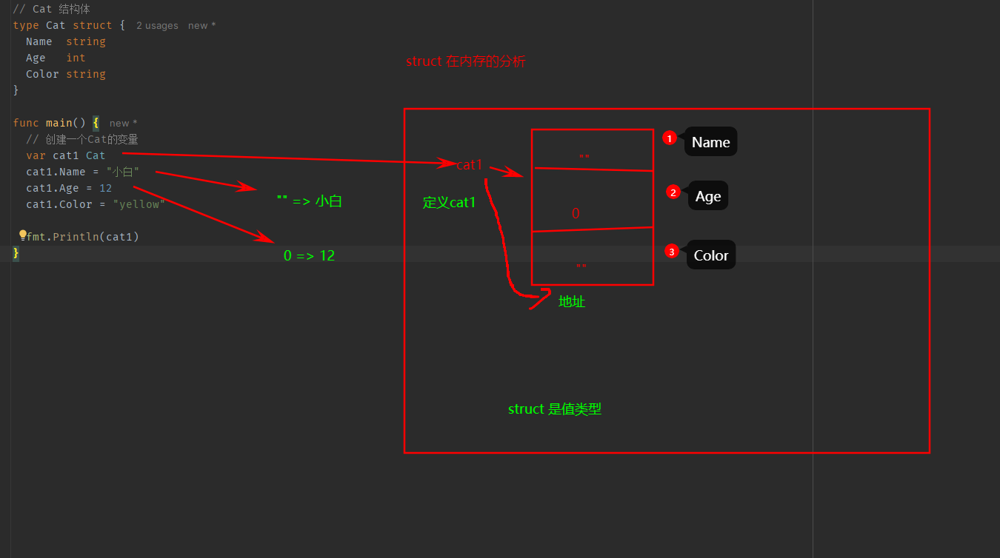

### map

map 是 `key-value`数据结构, 又称为字段或者关联数组. 类似其他变成语言的集合

基本语法: `var map变量名 map[keytype]valueType`

- `keyType:` golang 中的map的key可以是很多类型: 比如 `bool 数字 string 指针 channel 接口 结构体 数组`, 通常为 `int string`
- slice map 还有 function 不可以, 因为没法 == 来判断
- `valueType: `和key基本一样, 通常为 `数字 string map struct`

```go
// 声明: 不会分配内存, 初始化需要 make, 分配内存后才能赋值和使用
var a map[string]string
var a map[string]int
var a map[int]string
var a map[string]map[string]string


// map 在使用前一定要make
// key 不能重复, 重复了会覆盖
// value 可以相同
var b map[string]string = make(map[string]string, 10)
b["name"] = "张三"
b["name1"] = "李四"
b["name1"] = "张三"
fmt.Println(b) // map[name:张三]

// make 使用
// 1. 先声明再赋值
var a map[string]int
a = make(map[string]int, 10)

// 2. 声明,就直接make
var a = make(map[string]int)

// 3. 声明直接赋值
var a = map[string]int{"name": 12}
```

**map的增删改查操作**

```go
// 增加和更新
map["key"] = value // key还没有, 就是增加, key存在就是修改

// 删除
delete(map, "key")
// 删除所有: 1. 遍历,逐个删除 2. 直接make一个新的空间
var a = make(map[string]int)

// 查找
val, findRes = map["key"]
```

- map遍历: `for-range`
- map的长度: len(map)
- map切片: 切片的数据类型如果是map, 择我们称为 slice of map, map切面, 这样使用map个数就可以动态变化了

**map使用细节**

- map是引用类型, 组训引用类型传递的机制, 在一个函数接受map,修改,会直接修改原来的map
- map的容量达到后,再想增加元素, 会自动扩容, 并不会panic
- map 的 value也经常使用 struct 类型, 更适合管理复杂的数据


---

### 面向对象

- Golang也支持面向对象编程, 但不是纯粹的面向对象语言, 所以说 Golang支持面向对象编程特性
- Golang没有类(class), Go语言的结构体struct和其他语言的类class有相等的地位, 可以理解Golang是基于struct实现OOP特性的
- Golang面向对象变成简介, 去掉了传统的继承 方法重载 构造函数和析构函数 隐藏的this指针等等
- Golang仍有面面向对象的继承 封装和多态的特性,Golang没有extends关键字, 继承是通过匿名字段实现
- Golang通过interface关联 面向接口编程

**结构体**

1. 将一类事物的特征提取出来, 比如猫: 年龄 名字 颜色等, 形成一个新的数据类型, 就是一个结构体
2. 通过结构体, 可以创建多个变量(实例/对象)
3. 是自定义的数据类型, 代表一类事物
4. 结构体变量是具体的, 代表一个具体变量

```go
// Cat 结构体
type Cat struct {
	Name  string
	Age   int
	Color string
}

// 创建一个Cat的变量
var cat1 Cat
cat1.Name = "小白"
cat1.Age = 12
cat1.Color = "yellow"
```



```go
// 声明结构体
type 结构体名称 struct {
	// 从概念上看, 结构体字段 = 属性 = field, 统一叫字段
	field1 type
	field2 type
}


type Student struct {
    Name string
		
}

var person Student = Student{Name: "yym"}

var person *Student = new (Student)
var person *Student = &Person{}
// 上面两种方式返回的都是结构体指针
var m1 *Monster = new(Monster)
// 因为 m1 是指针, 因此标准的给字段赋值
(*m1).Name = "yym"
(*m1).Age = 15

var m2 *Monster = &Monster{
  Name: "yym1",
  Age:  10,
}
(*m2).Name = "yym1_修改"
fmt.Println("m2", *m2)
```

**结构体注意事项**

- 结构的所有字段在内存中是连续的
- 结构体是用户单独定义的类型, 和其它类型进行转换时需要有完全相同的字段
- 结构体进行 type 重新定义(取别名), Golang认为是新类型, 但是之间可以强转
- struct 的每个字段上, 可以写一个tag, 该tag可以通过反射机制获取, 常见使用序列化和反序列化


```go
type A struct {
	Num int
}

type B struct {
    Num int
}

var a A
var b B
b = B(a) // 自定义类型需完全相同


type Student {
	Name string
}
type Stu Student

// tag 序列化
type Monster struct {
  Name string `json:"name"`
  Age  int    `json:"age"`
}
```

---

### 方法

在某些情况下, 我们需要定义方法, 比如Person结构体: 除了一些字段外(name, age), Person
结构体还有一些行为: 说话, 跑步..., 这时需要用到方法

Golang中的`方法作用在指定的数据类型上`, 因此 `自定义类型, 都可以有方法`, 不仅仅 struct

```go
// 方法的声明和调用

type A struct {
	Num int
}

// func (a A) test() A结构体有一个方法, 名为 test
// (a A) 体现test方法和A类型绑定的
func (a A) test()  {
  fmt.Print(a.Num)
}


type PersonM struct {
  Name string
}

// 给Person类型绑定方法
// test方法和PersonM类型绑定
// p 这个形参由程序员指定, 非固定
func (p PersonM) test() { // p表示那个Person变量调用,这个p就是它的副本
  fmt.Println("test()", p.Name)
}

func main() {
  var p PersonM
  p.Name = "yym"
  // test方法只能通过 Person类型的变量来调用, 不能直接调用, 不能使用其他类型来调用
  p.test()
}
```
 
方法的调用和传参机制

- 方法的调用和传参机制和函数基本一致, 不同的是方法调用时, 会将调用方法的变量, 当做实参也传递给方法


方法的声明和定义

```go
/**
  参数列表: 表示方法输入
  receiver type: 表示这个方法和type这个类型进行绑定, 该方法作用域 type类型
    type 可以是结构体, 也可以是其他自定义类型
  receiver: 就是type类型的一个变量
  返回值列表: 返回的值, 可以多个
  return语句不是必须得
 */
func (receiver type) methodName (参数列表) (返回值列表) {
	方法体
	return 返回值
}
```

方法注意事项和细节

- 结构体类型是值类型, 在方法调用, 遵循值类型的传递机制, 值拷贝
- 希望在方法中, 修改结构体变量的值, 通过结构体指针的方式来处理
- Golang中的`方法作用在指定的数据类型上`, 自定义类型, 都可以有方法
- 方法的访问范围控制的规则, 和函数一样, 方法名首字母小写, 只能在本包访问, 大写, 可以在本包和其他包访问
- 如果一个变量实现了 `String()` 方法, 那么 fmt.Println 会默认调用这个变量的 `String()` 进行输出


```go
// 自定义类型
type integer int

func (i integer) print() {
	fmt.Println("i=", i)
}
```

方法和函数的区别

1. 调用方式不一样
   - 函数: 函数名(实参列表)
   - 方法: 变量.方法名(实参列表)
2. 对于普通函数, 接受者为值类型时, 不能将指针类型的数据直接传递, 反之亦然
3. 对于方法, 接受者为值类型时, 可以直接用指针类型的变量调用法法, 反过来也可以