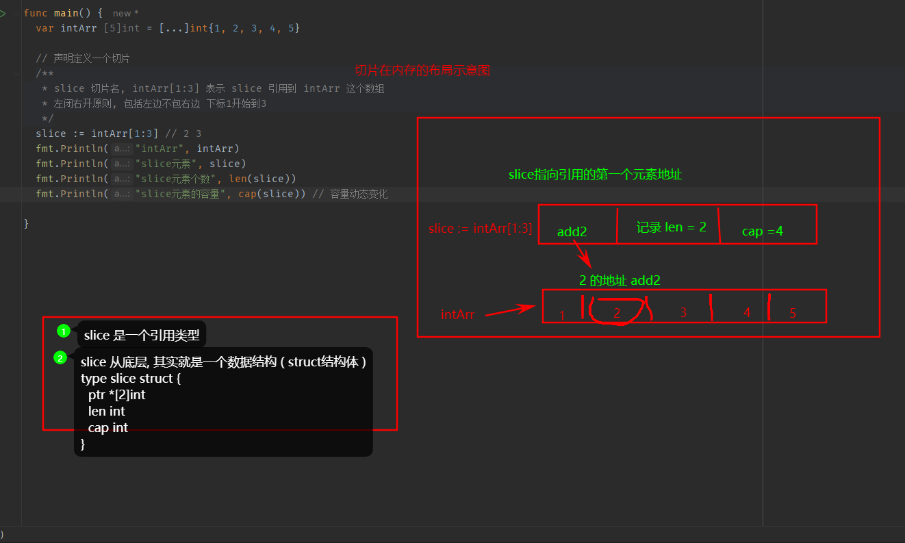
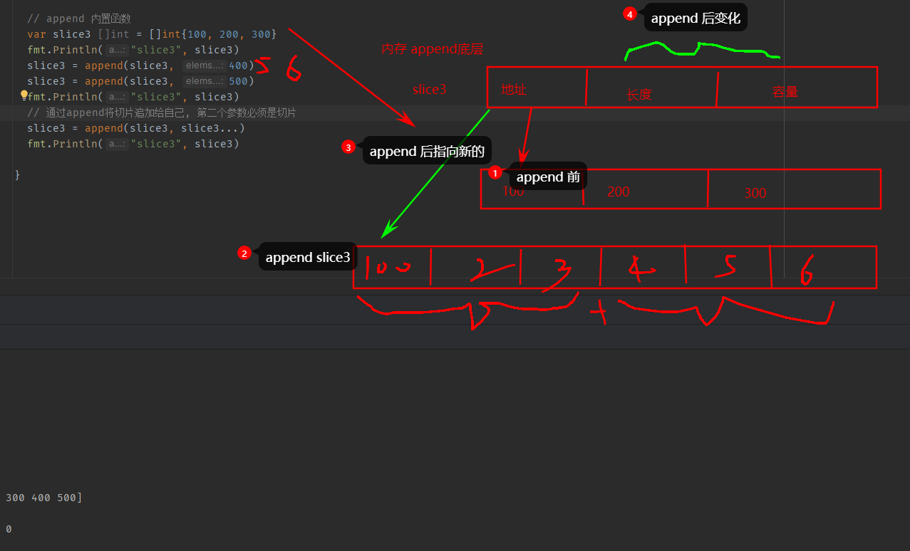
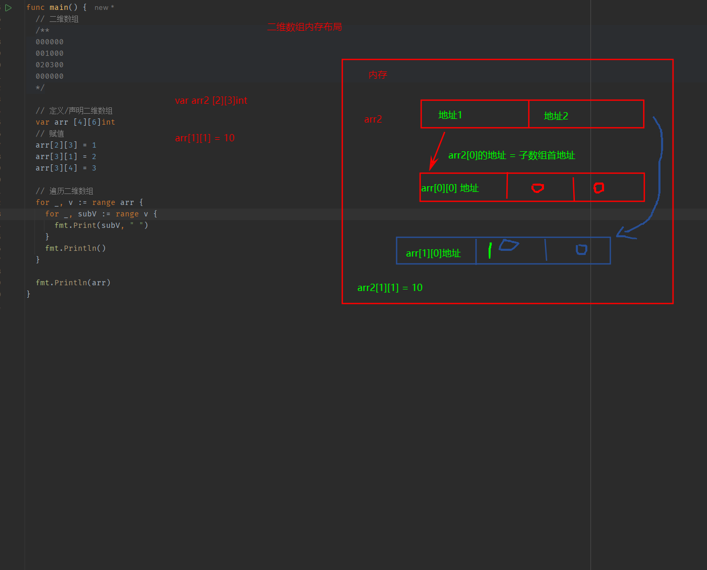

### 数组

数组是可以存放多个同一类型数据, 数组也是一种数据类型, 在Go中, 数组是`值类型`

**数组注意事项和细节**

1. 数组是多个相同类型数据的组合,一个数组一旦声明/定义了, 其长度固定的, 不能动态变
2. `var arr []int`  这时 arr 就是一个切片
3. 数组中的元素可以是任何数据类型, 包括值类型和引用类型, 但是不能混用
4. 数组创建以后, 如果没有赋值, 有默认值
   - 数值类型数组: 默认值 0
   - 字符串数组: 默认值 ""
   - bool数组: 默认值 false
5. 使用数组 1. 声明数组并开辟空间 2. 给数组各个元素赋值 3. 使用数组
6. 数组下标从 0 开始
7. 数组下标必须在指定范围内使用, 否则 panic,
8. Go 数组属于 值类型, 默认情况会值传递, 值拷贝, 数组间不会相互影响
9. 如向在其他函数中, 去修改原来的数组, 可以使用引用传递
10. 长度是数组类型的一部分 `[3]int != []int`

```go
// 1. 定义数组
var arr [6]int
// 2. 初始化, 给数组赋值
arr[0] = 1
arr[1] = 2
arr[2] = 3
arr[3] = 4
arr[4] = 5
arr[6] = 6

// 简写

```

**数组定义和内存布局**

- 数组的地址可以通过数组名来获取 `&intArr`
- 数组的第一个元素的地址, 就是数组的首地址
- 数组每个元素的地址间隔是一句数组的类型决定, 比如int64 -> 8个字节
- %p 取出地址 pointer, 十六进制表示, 前缀 0x

```go
var 数组名 [数组大小]数组类型

var a [5]int
a[0] = 1 // ...

var intArr [3]int // 有默认值 0 0 0

// 内存  intArr => 0 | 0 | 0 (&intArr 的地址 => 0x...0a0)

// 访问数组元素
数组名[下标]
```

初始化数组的几种方式

- `var arr [3]int = [3]int{1, 2, 3}`
- `var arr = [3]int{1,2,3} `
- `var arr = [...]int{1,2,3} `
- `var arr = [...]int{1: 800, 0: 900, 2: 999}`
- `arr := [...]string{"32", "4"}`

数组遍历

```go
// 第一个 index 是数组的下标
// 第二个 value 是在该下标位置的值
// 它们都是在 for 循环内部可见的局部变量
// 不想使用 index 或者 value, 使用 _
for index, value := range arr {
	
}
```


### 切片 slice

- 切片是数组的一个引用, 因此切片是引用类型, 使用引用传递
- 切片的使用和数组类似, 遍历切片, 访问切片的元素和长度`len(slice)`都一样
- 切片的长度是可以变化的, 简单理解切边是一个可以动态变化数组
- 定义切片 `var 变量名 []类型 -> var a []int`
- `append 内置函数` 可以对切片动态追加
  - 切片append操作的本质是对数组扩容
  - go 底层会创建一个新的数组
  - 将 slice 原来包含的元素拷贝到新的数组 newArr
  - slice 创新引用到 newArr
- `copy内置函数` 拷贝
  - copy(p1, p2) 参数数据类型都是切片
  - 参数数据空间是独立的





**切片使用的三种方式**

1. 定义一个切片, 然后让切片引用一个已经创建好的数组 `var slice = arr[startI:endI]`
   - 从arr数组的start取到end, 不包含end
   - 范围 [0-len(arr)]
   - arr[0:end] 简写 arr[:end]
   - arr[start:len(arr)] 简写 arr[start:?]
   - arr[0:len(arr)] 简写 arr[:]
2. 通过`make`来创建切片
   - cap 是一个内置函数, 用于统计切片的容量, 最大可以存放多少个元素
   - 切片定义完后, 还不能使用, 本身是一个空的, 需要让其引用到一个数组, make一个空间供切片使用
   - 切片可以继续切片
3. 定义一个切片,直接指定具体数组
4. 1和2的区别: 
   - 1是直接引用数组, 数组是实现存在的, 程序员可见
   - 2是通过make创建的, 由切片底层维护, 程序员不可见

```go
// type 数据类型
// len 大小
// cap 指定切片容量
var 切片名 []type = make([], len, [cap])

// 3. 直接指定具体数组
var slice2 []string = []string{"tom", "jack", "mary"}
```

**切片的遍历**

1. for循环
2. for-range


**string和slice**

- string 底层是一个 `byte`数组, 因此 string 可以进行切片处理
- string 是不可变的, 不能通过 str[0] = 'z' 来修改字符串


### 二维数组

使用方式: 

1. 先声明/定义再赋值
2. 直接初始化

```go
var 数组名 [大小][大小]类型
var arr [2][3]int

var 数组名 = [大小][大小]类型{{初始值}, {初始值}...}
```




