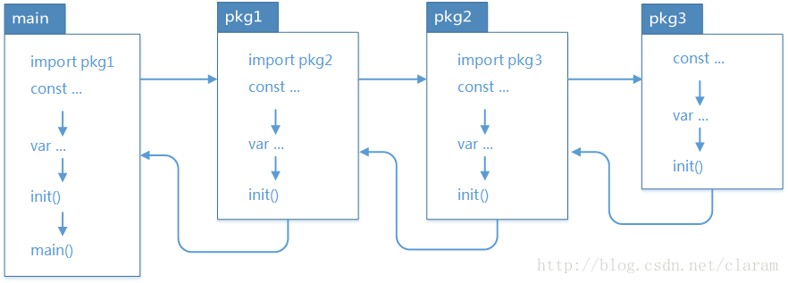

### 了解包的概念和作用

一个 Go 程序可以包含多个源文件, 但是每个源文件只能属于一个包. 一个包可以由多个文件组成, 但是这个文件必须在同一个目录下, 
并且文件名必须以`.go`为后缀. 在一个包中, 可以定义变量 常量 函数 类型等. 这些定义可以被其他包引用和使用

```go
// Go 语言包名是唯一的, 建议使用小写字母命名包名
import (
	"fmt"
	rand1 "math/rand"
	_ "xxxx/driver"
)
```

在 Go 中, `package`之间不允许循环引用的

#### init 函数

每个 `package` 都可以定义一个或者多个名为 `init` 的函数, 这些函数的作用是在程序启动时自动执行一些初始化操作, 例如初始化配置信息, 注册一些变量

`init` 函数定义必须满足一下两个条件: 
- 函数名必须为 `init`
- 函数没有参数和返回值

在一个 package 中, 可以定义多个 init 函数, 这些函数会按照定义的顺序自动执行, 

一个 package 中定义了多个 init 函数, 会按照它们在文件中出现的顺序依次执行




---

### 学习使用 go module 进行包的管理

Go mod 是一个用于管理 Go 语言模块依赖性的工具, 它是 `Go1.11` 中引入的, 通过使用 Go mod,
开发人员可以更轻松地管理其代码库中的依赖项, 同时还可以更加精细地控制依赖性的版本

`Go mod` 使用一个文件名为 `go.mod` 的文件来管理其依赖项. 当开发人员运行 `go build go test go run`等命令时,
Go mod 会自动下载所有必须得依赖项并将其存储在 `$GOPATH/pkg/mod`目录中. 通过使用 `go.mod`文件,
开发人员可以指定特定的依赖版本或版本范围, 并通过执行 `go mod tidy` 来自动升级依赖项

- `go mod init` 在当前目录中初始化 `go.mod` 文件, 用于管理依赖项
- `go mod tidy` 根据 `go.mod` 文件中的依赖关系清理模块, 移出未使用的依赖项, 并添加缺失的模块
- `go mod download` 下载 `go.mod` 列出的所有依赖项, 但不安装它们
- `go mod verify` 验证下载的依赖项的完整性和正确性
- `go mod graph` 以图形化形式显示模块之间的依赖关系
- `go mod why` 显示特定模块为什么需要特定依赖项
- `go mod list` 列出当前项目所有的依赖项

